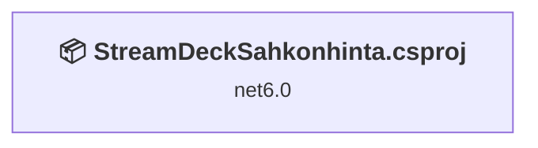
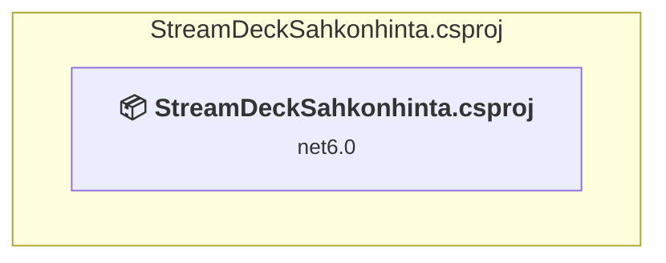

# Projects and dependencies analysis

This document provides a comprehensive overview of the projects and their dependencies in the context of upgrading to .NETCoreApp,Version=v10.0.

## Table of Contents

- [Executive Summary](#executive-Summary)
  - [Highlevel Metrics](#highlevel-metrics)
  - [Projects Compatibility](#projects-compatibility)
  - [Package Compatibility](#package-compatibility)
  - [API Compatibility](#api-compatibility)
  - [Binding Redirect Configuration](#binding-redirect-configuration)
- [Aggregate NuGet packages details](#aggregate-nuget-packages-details)
- [Top API Migration Challenges](#top-api-migration-challenges)
  - [Technologies and Features](#technologies-and-features)
  - [Most Frequent API Issues](#most-frequent-api-issues)
- [Projects Relationship Graph](#projects-relationship-graph)
- [Project Details](#project-details)

  - [StreamDeckSahkonhinta.csproj](#streamdecksahkonhintacsproj)

## Executive Summary

### Highlevel Metrics

| Metric | Count | Status |
| :--- | :---: | :--- |
| Total Projects | 1 | All require upgrade |
| Total NuGet Packages | 14 | 6 need upgrade |
| Total Code Files | 8 |  |
| Total Code Files with Incidents | 3 |  |
| Total Lines of Code | 620 |  |
| Total Number of Issues | 85 |  |
| Estimated LOC to modify | 77+ | at least 12,4% of codebase |

### Projects Compatibility

| Project | Target Framework | Difficulty | Package Issues | API Issues | Binding Issues | Est. LOC Impact | Description |
| :--- | :---: | :---: | :---: | :---: | :---: | :---: | :--- |
| [StreamDeckSahkonhinta.csproj](#streamdecksahkonhintacsproj) | net6.0 | 🟢 Low | 7 | 77 | 0 | 77+ | DotNetCoreApp, Sdk Style = True |

### Package Compatibility

| Status | Count | Percentage |
| :--- | :---: | :---: |
| ✅ Compatible | 8 | 57,1% |
| ⚠️ Incompatible | 0 | 0,0% |
| 🔄 Upgrade Recommended | 6 | 42,9% |
| ***Total NuGet Packages*** | ***14*** | ***100%*** |

### API Compatibility

| Category | Count | Impact |
| :--- | :---: | :--- |
| 🔴 Binary Incompatible | 0 | High - Require code changes |
| 🟡 Source Incompatible | 76 | Medium - Needs re-compilation and potential conflicting API error fixing |
| 🔵 Behavioral change | 1 | Low - Behavioral changes that may require testing at runtime |
| ✅ Compatible | 511 |  |
| ***Total APIs Analyzed*** | ***588*** |  |

## Aggregate NuGet packages details

| Package | Current Version | Suggested Version | Projects | Description |
| :--- | :---: | :---: | :--- | :--- |
| McMaster.Extensions.CommandLineUtils | 4.1.1 |  | [StreamDeckSahkonhinta.csproj](#streamdecksahkonhintacsproj) | ✅Compatible |
| Microsoft.Extensions.Configuration | 8.0.0 | 10.0.12 | [StreamDeckSahkonhinta.csproj](#streamdecksahkonhintacsproj) | NuGet package upgrade is recommended |
| Microsoft.Extensions.Configuration.Json | 8.0.0 | 10.0.12 | [StreamDeckSahkonhinta.csproj](#streamdecksahkonhintacsproj) | NuGet package upgrade is recommended |
| Microsoft.Extensions.Hosting | 8.0.0 | 10.0.12 | [StreamDeckSahkonhinta.csproj](#streamdecksahkonhintacsproj) | NuGet package upgrade is recommended |
| Microsoft.Extensions.Logging | 8.0.0 | 10.0.12 | [StreamDeckSahkonhinta.csproj](#streamdecksahkonhintacsproj) | NuGet package upgrade is recommended |
| Newtonsoft.Json | 13.0.3 | 13.0.4 | [StreamDeckSahkonhinta.csproj](#streamdecksahkonhintacsproj) | NuGet package upgrade is recommended |
| Serilog | 4.0.0 |  | [StreamDeckSahkonhinta.csproj](#streamdecksahkonhintacsproj) | ✅Compatible |
| Serilog.Extensions.Logging | 8.0.0 |  | [StreamDeckSahkonhinta.csproj](#streamdecksahkonhintacsproj) | ✅Compatible |
| Serilog.Settings.Configuration | 8.0.1 |  | [StreamDeckSahkonhinta.csproj](#streamdecksahkonhintacsproj) | ✅Compatible |
| Serilog.Sinks.File | 6.0.0 |  | [StreamDeckSahkonhinta.csproj](#streamdecksahkonhintacsproj) | ✅Compatible |
| StreamDeckLib | 0.* |  | [StreamDeckSahkonhinta.csproj](#streamdecksahkonhintacsproj) | ✅Compatible |
| StreamDeckLib.Config | 0.* |  | [StreamDeckSahkonhinta.csproj](#streamdecksahkonhintacsproj) | ✅Compatible |
| System.Drawing.Common | 8.0.0 | 10.0.12 | [StreamDeckSahkonhinta.csproj](#streamdecksahkonhintacsproj) | NuGet package upgrade is recommended |
| System.Net.WebSockets | 4.3.0 |  | [StreamDeckSahkonhinta.csproj](#streamdecksahkonhintacsproj) | NuGet package functionality is included with framework reference |

## Top API Migration Challenges

### Technologies and Features

| Technology | Issues | Percentage | Migration Path |
| :--- | :---: | :---: | :--- |
| GDI+ / System.Drawing | 76 | 98,7% | System.Drawing APIs for 2D graphics, imaging, and printing that are available via NuGet package System.Drawing.Common. Note: Not recommended for server scenarios due to Windows dependencies; consider cross-platform alternatives like SkiaSharp or ImageSharp for new code. |

### Most Frequent API Issues

| API | Count | Percentage | Category |
| :--- | :---: | :---: | :--- |
| T:System.Drawing.Graphics | 6 | 7,8% | Source Incompatible |
| T:System.Drawing.Drawing2D.LineCap | 6 | 7,8% | Source Incompatible |
| M:System.Drawing.Drawing2D.GraphicsPath.AddArc(System.Int32,System.Int32,System.Int32,System.Int32,System.Single,System.Single) | 4 | 5,2% | Source Incompatible |
| T:System.Drawing.SolidBrush | 4 | 5,2% | Source Incompatible |
| M:System.Drawing.SolidBrush.#ctor(System.Drawing.Color) | 4 | 5,2% | Source Incompatible |
| T:System.Drawing.GraphicsUnit | 4 | 5,2% | Source Incompatible |
| T:System.Drawing.FontStyle | 4 | 5,2% | Source Incompatible |
| T:System.Drawing.Drawing2D.GraphicsPath | 3 | 3,9% | Source Incompatible |
| T:System.Drawing.Text.TextRenderingHint | 3 | 3,9% | Source Incompatible |
| T:System.Drawing.Drawing2D.SmoothingMode | 3 | 3,9% | Source Incompatible |
| T:System.Drawing.Bitmap | 2 | 2,6% | Source Incompatible |
| T:System.Drawing.Imaging.ImageFormat | 2 | 2,6% | Source Incompatible |
| M:System.Drawing.Graphics.DrawString(System.String,System.Drawing.Font,System.Drawing.Brush,System.Single,System.Single) | 2 | 2,6% | Source Incompatible |
| M:System.Drawing.Graphics.MeasureString(System.String,System.Drawing.Font) | 2 | 2,6% | Source Incompatible |
| F:System.Drawing.GraphicsUnit.Pixel | 2 | 2,6% | Source Incompatible |
| T:System.Drawing.Font | 2 | 2,6% | Source Incompatible |
| M:System.Drawing.Font.#ctor(System.String,System.Single,System.Drawing.FontStyle,System.Drawing.GraphicsUnit) | 2 | 2,6% | Source Incompatible |
| F:System.Drawing.Drawing2D.LineCap.Round | 2 | 2,6% | Source Incompatible |
| P:System.Drawing.Imaging.ImageFormat.Png | 1 | 1,3% | Source Incompatible |
| M:System.Drawing.Image.Save(System.IO.Stream,System.Drawing.Imaging.ImageFormat) | 1 | 1,3% | Source Incompatible |
| M:System.Drawing.Drawing2D.GraphicsPath.CloseFigure | 1 | 1,3% | Source Incompatible |
| M:System.Drawing.Drawing2D.GraphicsPath.#ctor | 1 | 1,3% | Source Incompatible |
| F:System.Drawing.FontStyle.Regular | 1 | 1,3% | Source Incompatible |
| F:System.Drawing.FontStyle.Bold | 1 | 1,3% | Source Incompatible |
| M:System.Drawing.Graphics.FillPolygon(System.Drawing.Brush,System.Drawing.PointF[]) | 1 | 1,3% | Source Incompatible |
| M:System.Drawing.Graphics.DrawArc(System.Drawing.Pen,System.Drawing.Rectangle,System.Single,System.Single) | 1 | 1,3% | Source Incompatible |
| P:System.Drawing.Pen.EndCap | 1 | 1,3% | Source Incompatible |
| P:System.Drawing.Pen.StartCap | 1 | 1,3% | Source Incompatible |
| T:System.Drawing.Pen | 1 | 1,3% | Source Incompatible |
| M:System.Drawing.Pen.#ctor(System.Drawing.Color,System.Single) | 1 | 1,3% | Source Incompatible |
| M:System.Drawing.Graphics.FillPath(System.Drawing.Brush,System.Drawing.Drawing2D.GraphicsPath) | 1 | 1,3% | Source Incompatible |
| F:System.Drawing.Text.TextRenderingHint.AntiAliasGridFit | 1 | 1,3% | Source Incompatible |
| P:System.Drawing.Graphics.TextRenderingHint | 1 | 1,3% | Source Incompatible |
| F:System.Drawing.Drawing2D.SmoothingMode.AntiAlias | 1 | 1,3% | Source Incompatible |
| P:System.Drawing.Graphics.SmoothingMode | 1 | 1,3% | Source Incompatible |
| M:System.Drawing.Graphics.FromImage(System.Drawing.Image) | 1 | 1,3% | Source Incompatible |
| M:System.Drawing.Bitmap.#ctor(System.Int32,System.Int32) | 1 | 1,3% | Source Incompatible |
| T:System.Net.Http.HttpContent | 1 | 1,3% | Behavioral Change |

## Projects Relationship Graph

Legend:
📦 SDK-style project
⚙️ Classic project

## Project Details

### StreamDeckSahkonhinta.csproj

#### Project Info

- **Current Target Framework:** net6.0
- **Proposed Target Framework:** net10.0
- **SDK-style**: True
- **Project Kind:** DotNetCoreApp
- **Dependencies**: 0
- **Dependants**: 0
- **Number of Files**: 19
- **Number of Files with Incidents**: 3
- **Lines of Code**: 620
- **Estimated LOC to modify**: 77+ (at least 12,4% of the project)

#### Dependency Graph

Legend:
📦 SDK-style project
⚙️ Classic project

### API Compatibility

| Category | Count | Impact |
| :--- | :---: | :--- |
| 🔴 Binary Incompatible | 0 | High - Require code changes |
| 🟡 Source Incompatible | 76 | Medium - Needs re-compilation and potential conflicting API error fixing |
| 🔵 Behavioral change | 1 | Low - Behavioral changes that may require testing at runtime |
| ✅ Compatible | 511 |  |
| ***Total APIs Analyzed*** | ***588*** |  |

#### Project Technologies and Features

| Technology | Issues | Percentage | Migration Path |
| :--- | :---: | :---: | :--- |
| GDI+ / System.Drawing | 76 | 98,7% | System.Drawing APIs for 2D graphics, imaging, and printing that are available via NuGet package System.Drawing.Common. Note: Not recommended for server scenarios due to Windows dependencies; consider cross-platform alternatives like SkiaSharp or ImageSharp for new code. |

